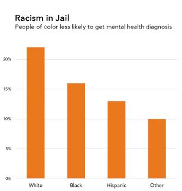

# How Context Helps Us Better Understand Data
## By Leanna Sun
## _July 12, 2023_

## Data Viz Summary 

The bar graph:bar_chart: titled “Mental Health in Jail” in the first image and “Racism in Jail” in the second image illustrate the same data representing the percentage of incarcerated individuals who received mental health diagnoses between 2011-2013. The data is pulled from individuals incarcerated for the first time across jails in New York City. The individuals are categorized into groups determined by race, showing that over 20% of diagnosed individuals were white, making it the largest group. This is followed by Black individuals at around 16%, then the Hispanic category at around 13%, and lastly, individuals belonging to other races under the “Other” category stand as the smallest group at 10%. As _Data Feminism_ states, the first graph differs from the second in that: 
> The title does not mention race or ethnicity, or racism or health inequities, nor does the title point to what the data mean. But this is where additional questions about context come in.

## Data Viz Biography
 **1. Who or what institution produced the visualization? (Hint: refer to ["Figure Credits"](https://data-feminism.mitpress.mit.edu/pub/ftb0980j/release/1?readingCollection=0cd867ef))**

The visualizations was produced by Catherine D'Ignazio and the data used was pulled from a [study](https://ajph.aphapublications.org/doi/full/10.2105/AJPH.2015.302699) done by Fatos Kaba in the _American Journal of Public Health_.

  **2. When was it produced?**

The graphs were produced in September of 2015. 

  **3. Who is the audience for the visualization?**

  The audience for the visualizations includes researchers and those in academia studying criminal justice, mental health in the criminal justice system, or racial disaprities across the system, or even an intersection of all these topics. Policymakers are also part of the audience as they can use the information and data from the visualizations when developing or amending policies related to mental health services during incarceration. Additionally, anyone in general who is interested in these topics and mental health services in jail can read the study and look at the graphs. The graphs and overall study were published to inform the public about inconsistencies in mental health diagnoses in NYC jails due to racial bias, so the general public is also part of the intended audience.

  **4. How might the visualization be interpreted or misinterpreted? What consequences might this interpretation/misinterpretation have?**

The difference in the titles and and subheading of the two graphs demonstrate how without context, visualized data can be interpreted in unmeaningful or unintended ways that stray from the initial purpose of such data being collected and produced into graphs. The study intended for the data and graphs to put an emphasis on the racial aspect in the difference of diagnoses seen between racial groups, which is clearly noted in the title of the second graph, and even more explicitly stated in the subheading. However, the title and subheading of the first graph do not put focus on the racial disaparities, and instead shifts the focus onto just mental health diagnoses in jail. If the audience were to see the first graph, the consequences entail overlooking the issue of racial bias and disparity in the criminal justice system. This would only perpetuate and enforce these issues, creating an ongoing cycle where people of color are overlooked and mistreated, rather than shining light on the disaparities and finding solutions for them. These two graphs display how all aspects of a data visualization are important in helping the audience interpret the data in a meaningful way. 

  **5. How, if at all, does the data visualization represent power or systems?**

Those who are in positions to produce data visualizations to audiences have power over how the public may interpret the data and visualization. In this specific instance, how the graph is titled can heavily influence how one may look at the graph and what conclusions can be made. If the creator of the graph stuck with the first title and subheading, those who look at it may not even think about how race is involved and how pressing of an issue racial disaprity in these systems is. The second graph, with racial discrimination in focus, clearly illustrates that white people hold power over people of color in the criminal justice system. The graph proves how instituions and systems like the criminal justice system continue to prioritize and protect white individuals over marginalized communities and people of color. This power and power imbalance is either perpetuated by data visualization like the first graph, or challenged and confronted by data visualization in the second graph.